# Project Report Lapr3

## Delivery of Pharmaceutical Products ##

### Teachers/Advisors ###
Carlos Ramos - CAR\
Isabel Sampaio - AIS\
Ana Raquel Faria - ARF\
Nelson Manuel Freire - NMF

### Client ###
Nuno Bettencourt - NMB

## Classes DC_DD – Group 052 ##
1170640 Ricardo Mourisco\
1171060 André Silva\
1182147	António Dias\
1190708 João Gonçalo Ferreira\
1200607 Beatriz Meireles

### Abstract ###
In this report we started by stating the initial problem presented to us, which consists in constructing a Java application that supports the delivery of pharmaceutical products.
The application doesn't need an interface but we must follow a Test Driven Development approach by using the Jenkins® and SonarQube® servers.
Prior to the coding development we have focused our work in the engineering software artifacts that would be relevant when coding.
All our work was distributed among the five members of the group and we have tried to follow an equally distribution, which wasn’t perfect.
In this report we pretend to give a briefly description of our work and what our application is capable of doing.

### Theorical Introduction ###
The Project presented to us required us to elaborate a product that supports the delivery of pharmaceutical products. This service should allow managing users, electric scooters, drones, parks, products, orders and deliveries.
Dispite our application do not have an UI to interact with. It should run through tests. Data should be passed through external files and inserted into the Data-Base, then we should be able to manage the inserted information and work from there. 
That being said, those same tests should check if we were getting the expected result when accessing the Data-Base.


### Work Organization, Planning and Methodology ###
The methodology followed by our group is based on the Scrum®, so, all our work was developed in a certain way, starting by planning who and what, each member of the group was going to do.
One of the core parts in our team is the cooperation, since without that it would be near impossible to work as a team. Each and every member was there to discuss ideas and give the requested assistance, provided everyone was doing its part of the work.
As expected, this project relied on transparency and adaptation of every single member of the group, since there was a constant analysis of what was done and how it was done. The communication and the inter-help were always present in the group, since this is a group work and not various single works.
In order to help out with the organization of the Project we have used the Jira Software.

Firstly we have identified the user-stories that we found out to be present and elaborated the Use-Cases Diagram presented ahead.
After that, and following a Scrum metodology, we have given an estimation value so we could know how long it would take each use-case.
Each use-case was assigned to a member of the team, however the cooperation was emphasised due to the fact that a certain member could be better than another one on a certain task.
On the following days each member worked on his/her use-case and whenever there was some free-time, we were at our disposal to help out othe members.

### Plannning Poker example


Then, we started by elaborating the Use-Case diagram, which can be seen ahead:
### Use-Cases Diagram for this current Project: ###
!!!!!FALTA USE CASE!!!!!

With these Use-Cases in mind we have put effort into elaborating the Software Engineering diagrams.

We have elaborated the Domain Model that we would follow while developping our Project,  which can be seen ahead:
### Domain-Model for this current Project: ###
!!!!!!FALTA MODELO DE DOMINIO!!!!!!

### SSDs Diagrams ###
Then we have elaborated some of the relevant SSDs diagrams.\
Sprint 1:

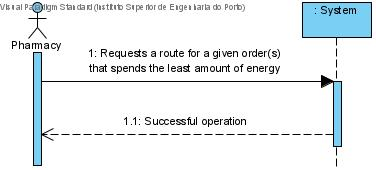
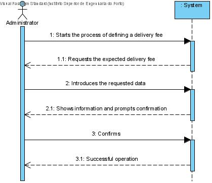
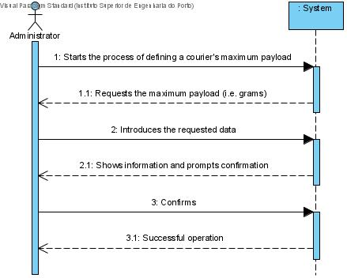
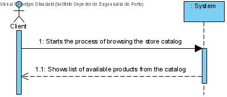
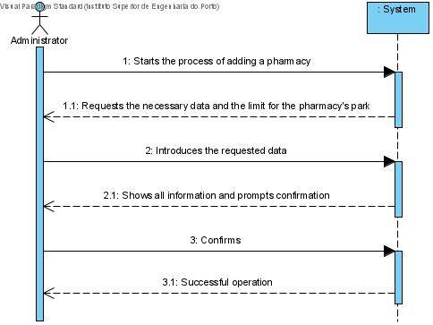
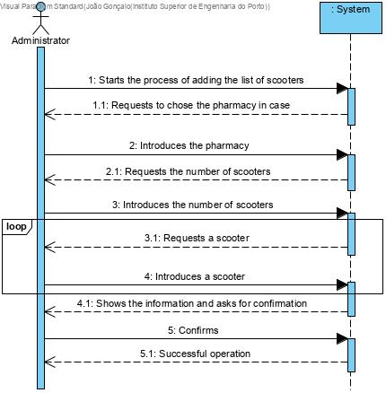
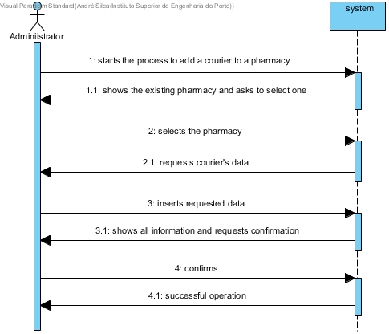
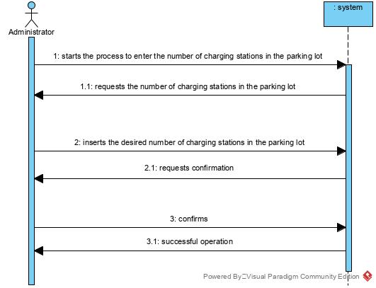
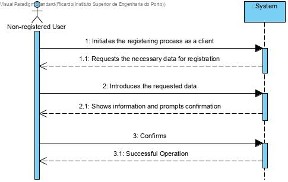
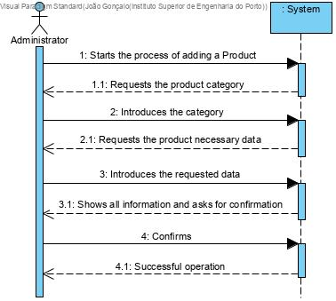
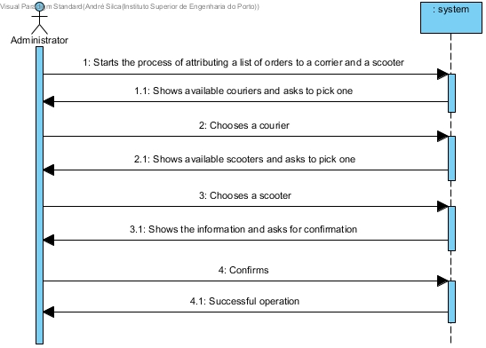
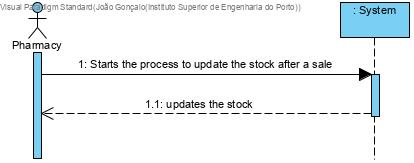
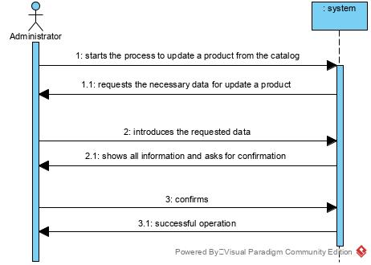
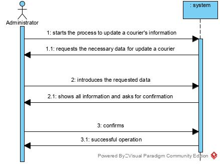
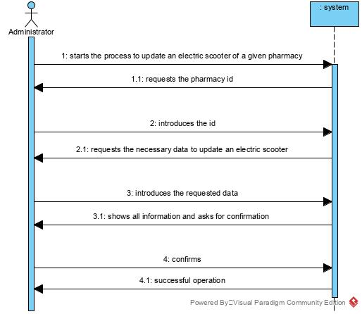
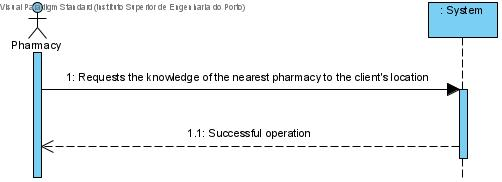

Sprint 2:

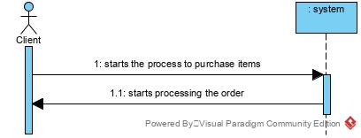
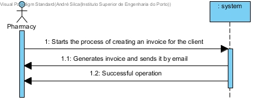
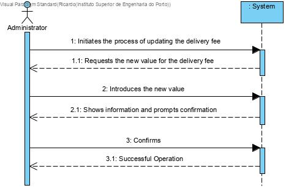
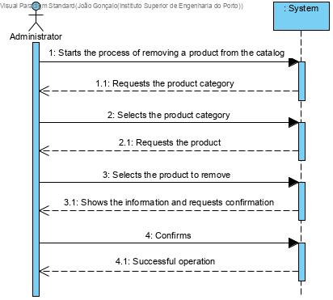
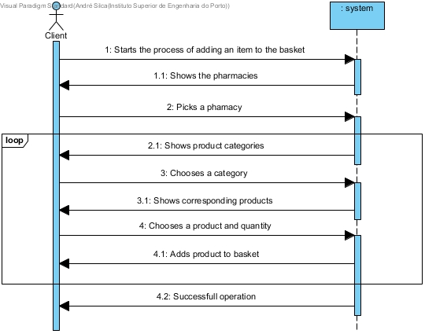
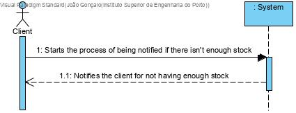
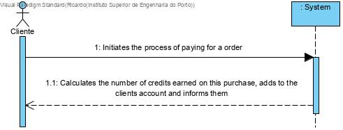
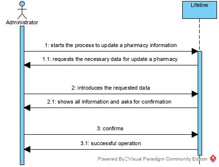
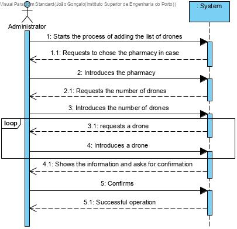
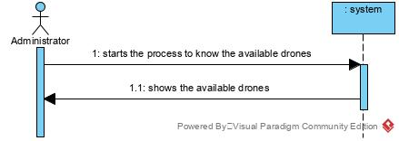
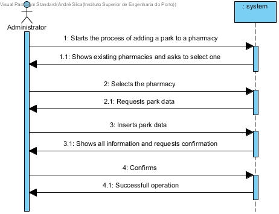
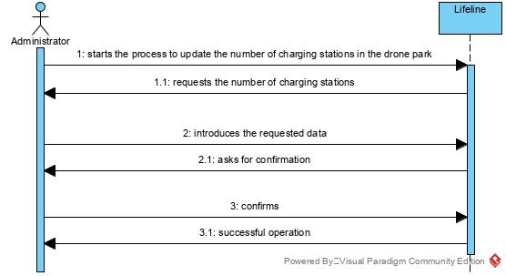
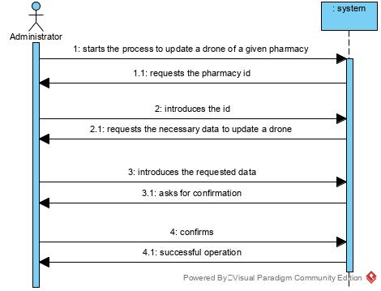
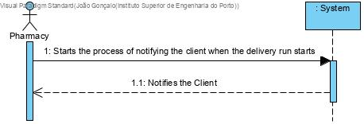
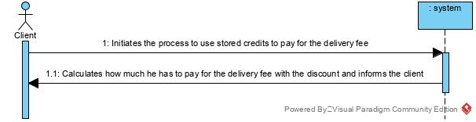

Sprint 3:

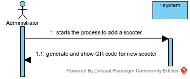
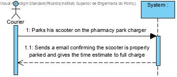
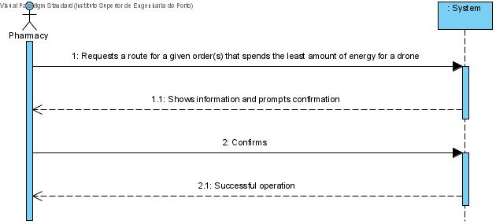
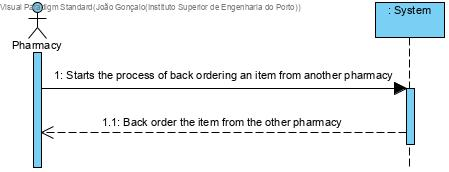
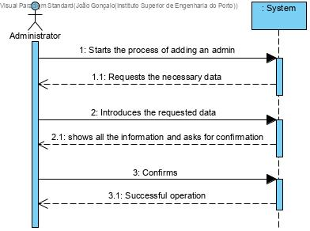

Finally, when it comes to Software Engineering, we have elaborated the Relational Model, which can be seen ahead:
### Relational-Model for this current Project: ###
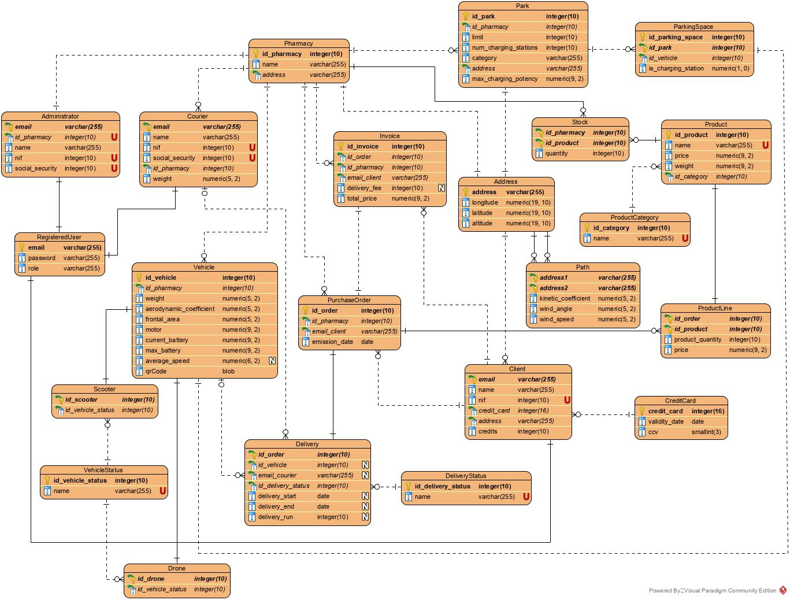

This Relational Model is the one that we have followed when it comes to the elaboration of the Tables in the data-base creation.

### Conclusion ###
With this report we could conclude that we have learned a lot during this LAPR3 course. We have worked a lot with all the knowledge acquired during ESINF, BDDAD and FSIAP classes.
During this project, we encountered several difficulties but we solved most of them.
However, we think that we have achieved some of the what was asked. That said, we also realized how difficult, mainly due to the period we are going through. We also realized that sometimes working in groups can be quite challenging, since each has their own way of understanding things and your own pace.
All in all, we can say that with the elaboration of this project we have increased our knowledge both in terms of Java® programming as also in terms of Oracle SQL®. We also augmented our portfolio by gaining the basic knowledge about a Test Driven Development way of work.


#################################################################################


# README INFO #

This is the repository template used for student repositories in LAPR Projets.

## Java source files

Java source and test files are located in folder src.

## Maven file

Pom.xml file controls the project build.

# Notes
In this file, DO NOT EDIT the following elements:

* groupID
* artifactID
* version
* properties

Beside, students can only add dependencies to the specified section of this file.

## Eclipse files

The following files are solely used by Eclipse IDE:

* .classpath
* .project

## IntelliJ Idea IDE files

The following folder is solely used by Intellij Idea IDE :

* .idea

# How was the .gitignore file generated?
.gitignore file was generated based on https://www.gitignore.io/ with the following keywords:

  - Java
  - Maven
  - Eclipse
  - NetBeans
  - Intellij

# Who do I talk to?
In case you have any problem, please email Nuno Bettencourt (nmb@isep.ipp.pt).

# How do I use Maven?

## How to run unit tests?

Execute the "test" goals.

`$ mvn test`

## How to generate the javadoc for source code?

Execute the "javadoc:javadoc" goal.

`$ mvn javadoc:javadoc`

This generates the source code javadoc in folder "target/site/apidocs/index.html".

## How to generate the javadoc for test cases code?

Execute the "javadoc:test-javadoc" goal.

`$ mvn javadoc:test-javadoc`

This generates the test cases javadoc in folder "target/site/testapidocs/index.html".

## How to generate Jacoco's Code Coverage Report?

Execute the "jacoco:report" goal.

`$ mvn test jacoco:report`

This generates a jacoco code coverage report in folder "target/site/jacoco/index.html".

## How to generate PIT Mutation Code Coverage?

Execute the "org.pitest:pitest-maven:mutationCoverage" goal.

`$ mvn test org.pitest:pitest-maven:mutationCoverage`

This generates a PIT Mutation coverage report in folder "target/pit-reports/YYYYMMDDHHMI".

## How to combine different maven goals in one step?

You can combine different maven goals in the same command. For example, to locally run your project just like on jenkins, use:

`$ mvn clean test jacoco:report org.pitest:pitest-maven:mutationCoverage`

## How to perform a faster pit mutation analysis?

Do not clean build => remove "clean"

Reuse the previous report => add "-Dsonar.pitest.mode=reuseReport"

Use more threads to perform the analysis. The number is dependent on each computer CPU => add "-Dthreads=4"

Temporarily remove timestamps from reports.

Example:

`$ mvn test jacoco:report org.pitest:pitest-maven:mutationCoverage -DhistoryInputFile=target/fasterPitMutationTesting-history.txt -DhistoryOutputFile=target/fasterPitMutationTesting-history.txt -Dsonar.pitest.mode=reuseReport -Dthreads=4 -DtimestampedReports=false`

## Where do I configure my database connection?

Each group should configure their database connection on file: 

* src/main/resources/application.properties

# Oracle repository

If you get the following error:

```
[ERROR] Failed to execute goal on project 
bike-sharing: Could not resolve dependencies for project 
lapr3:bike-sharing:jar:1.0-SNAPSHOT: 
Failed to collect dependencies at 
com.oracle.jdbc:ojdbc7:jar:12.1.0.2: 
Failed to read artifact descriptor for 
com.oracle.jdbc:ojdbc7:jar:12.1.0.2: 
Could not transfer artifact 
com.oracle.jdbc:ojdbc7:pom:12.1.0.2 
from/to maven.oracle.com (https://maven.oracle.com): 
Not authorized , ReasonPhrase:Authorization Required. 
-> [Help 1]
```

Follow these steps:

https://blogs.oracle.com/dev2dev/get-oracle-jdbc-drivers-and-ucp-from-oracle-maven-repository-without-ides

You do not need to set a proxy.

You can use existing dummy Oracle credentials available at http://bugmenot.com.